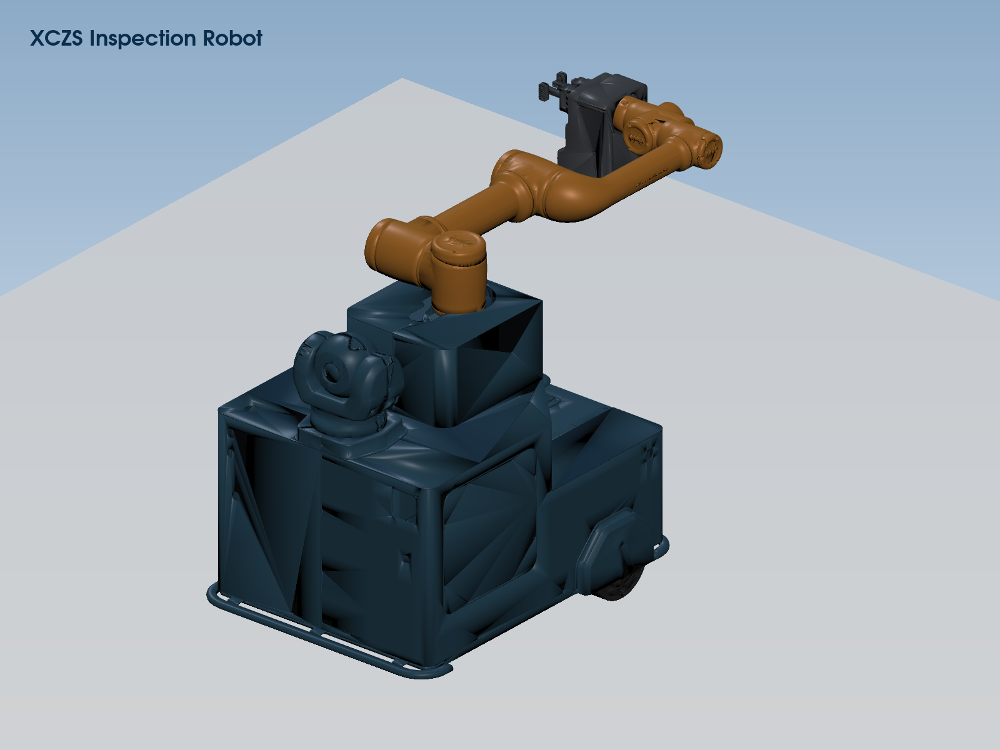

# XCZS 巡操机器人仿真

基于 ROS 2 Humble 和 Gazebo Classic 的巡操机器人仿真项目，包含移动底盘、
六自由度机械臂、两指夹爪、腕部 RGB 相机、车身 2D 激光雷达、手动控制、
自主巡检以及 Web 数据监控。



## 功能概览

- ROS 2 Humble + Gazebo Classic 11 仿真，不包含 ROS 1 启动或通信逻辑
- 移动底盘、六自由度机械臂、两指夹爪和控制柜碰撞仿真
- 腕部 RGB 相机和车身 180° 2D 激光雷达
- Qt GUI、键盘、网页和自主任务四种互斥控制模式
- 浏览器 MJPEG 相机画面、WebSocket 雷达扫描和 SSE 状态监控
- `run_all.sh` 一键启动、统一退出和子进程清理

## 运行环境

- Ubuntu 22.04
- ROS 2 Humble
- Gazebo Classic 11
- `colcon`、Xacro 和 Qt 5

Web 监控还需要：

- `/opt/zenoh-bridge-ros2dds/zenoh-bridge-ros2dds`
- Python 依赖：`jiang/requirements.txt`（Zenoh、HTTP/WebSocket、JPEG 编码）

## 获取与编译

```bash
git clone https://github.com/9999-rgb/work01.git
cd work01
source /opt/ros/humble/setup.bash
colcon build --symlink-install
source install/setup.bash
```

如果终端当前处于 Conda 环境，请先执行 `conda deactivate`。

## 快速启动

推荐使用网页控制模式启动完整系统：

```bash
/usr/bin/python3 -m pip install -r jiang/requirements.txt
./run_all.sh --web
```

启动完成后打开：

```text
http://localhost:8080/monitor.html
```

点击页面顶部的“连接”，相机和雷达会自动连接；底盘、机械臂和夹爪控制服务
也会自动检测。按 `Ctrl+C` 可统一关闭 Gazebo、Web 服务和桥接进程。

## 其他启动方式

### 仅启动 ROS 2 仿真

```bash
ros2 launch xczs_inspection_robot_control inspection_robot.launch.py
```

该命令启动 Gazebo、巡操机器人、控制柜模型和 Qt 控制界面。控制柜默认位于
`x=2.0`、`y=0.33`，并已从 SolidWorks 的 Y-up 坐标系旋转为 Gazebo 的
Z-up 坐标系。

如需调整控制柜位置或不加载控制柜，可使用统一启动入口的参数：

```bash
ros2 launch xczs_inspection_robot_control inspection_robot.launch.py \
  cabinet_x:=3.0 cabinet_y:=0.0 cabinet_yaw:=-1.5708

ros2 launch xczs_inspection_robot_control inspection_robot.launch.py \
  spawn_cabinet:=false
```

### 完整系统控制模式

首次使用 Web 功能时安装 Python 依赖：

```bash
/usr/bin/python3 -m pip install -r jiang/requirements.txt
```

按需要选择一种控制模式：

| 模式 | 命令 | 用途 |
| --- | --- | --- |
| Web 控制 | `./run_all.sh --web` | 浏览器监控并控制底盘、机械臂和夹爪 |
| Qt GUI | `./run_all.sh --manual` | 使用桌面控制界面 |
| 键盘遥控 | `./run_all.sh --keyboard` | 使用键盘控制机器人 |
| 自主任务 | `./run_all.sh --task` | 自动执行 A→B→C→D 巡检流程 |

无图形桌面或不需要 Gazebo 窗口时，在命令后添加 `--no-gui`，例如：

```bash
./run_all.sh --web --no-gui
```

四种控制模式互斥，不要同时启动多个控制节点。

## Web 监控

启动完整系统后访问：

```text
http://localhost:8080/monitor.html
```

点击“连接”，再选择需要监控的话题。监控数据每秒更新一次；Web 控制功能仅在
`--web` 模式下可用。腕部相机和车身雷达无需手动订阅，点击“连接”后会自动
连接 MJPEG 图像流和雷达 WebSocket。浏览器相机流默认为约 `10 FPS`，雷达
WebSocket 默认为约 `10 Hz`；这不会改变 ROS 2 原始相机 `30 Hz` 和雷达
`40 Hz` 的发布频率。

| 服务 | 地址 |
| --- | --- |
| 监控页面 | `http://localhost:8080/monitor.html` |
| SSE 数据 | `http://localhost:8001` |
| 相机与雷达流 | `http://localhost:8003` |
| Web 控制 | `http://localhost:8090` |
| Zenoh TCP | `tcp/localhost:7447` |

前后端接口格式和调用示例见
[FRONTEND_API.md](FRONTEND_API.md)。

传感器流服务提供以下浏览器接口：

| 接口 | 格式 | 用途 |
| --- | --- | --- |
| `/camera.mjpg` | `multipart/x-mixed-replace` | 浏览器实时相机画面 |
| `/camera.jpg` | `image/jpeg` | 获取最新单帧图像 |
| `/lidar.json` | JSON | 获取最新一帧雷达扫描 |
| `/lidar/ws` | WebSocket JSON | 持续接收雷达扫描 |
| `/health` | JSON | 检查相机和雷达数据状态 |

可直接使用以下命令检查传感器 Web 服务：

```bash
curl http://localhost:8003/health
curl http://localhost:8003/lidar.json
curl http://localhost:8003/camera.jpg --output camera.jpg
```

从其他计算机访问并控制时，应让控制服务监听局域网地址：

```bash
CONTROL_HOST=0.0.0.0 ./run_all.sh --web
```

然后在另一台计算机打开
`http://<simulation-host-ip>:8080/monitor.html`。页面会自动使用当前主机名
连接 `8001`、`8003` 和 `8090` 端口，无需手动把 `localhost` 改成服务器
地址。局域网防火墙至少需要允许 TCP 端口 `8001`、`8003`、`8080` 和
`8090`；浏览器不需要直接访问 Zenoh TCP 端口。

Web 服务端口可通过环境变量调整：

| 环境变量 | 默认值 | 用途 |
| --- | --- | --- |
| `MONITOR_PORT` | `8080` | 监控页面 |
| `SSE_PORT` | `8001` | 常规 ROS 2 数据 SSE |
| `SENSOR_PORT` | `8003` | 相机和雷达 Web 服务 |
| `CONTROL_PORT` | `8090` | 网页控制服务 |
| `CONTROL_HOST` | `127.0.0.1` | 网页控制监听地址 |
| `SENSOR_HOST` | `0.0.0.0` | 传感器流监听地址 |

## 键盘控制

| 按键 | 功能 |
| --- | --- |
| `W` / `S` | 前进 / 后退 |
| `A` / `D` | 左转 / 右转 |
| `X` / 空格 | 平滑停止 / 紧急停止 |
| `1`～`6` | 选择机械臂关节 |
| `[` / `]` | 减小 / 增大关节角度 |
| `R` | 机械臂回零 |
| `O` / `P` | 打开 / 关闭夹爪 |
| `Q` | 退出 |

## ROS 2 节点

| 节点 | 功能 |
| --- | --- |
| `/gazebo` | 运行物理仿真并发布仿真时间 |
| `/robot_state_publisher` | 发布机器人模型和 TF |
| `/xczs/xczs_planar_move` | 接收底盘速度并发布里程计 |
| `/xczs/xczs_joint_pose_trajectory` | 执行机械臂和夹爪轨迹 |
| `/xczs/xczs_joint_state_publisher` | 发布机器人关节状态 |
| `/xczs_inspection_robot_gui` | Qt GUI 控制节点 |
| `/xczs_keyboard_teleop` | 键盘控制节点 |
| `/xczs_task_scheduler` | 自主巡检任务节点 |
| `/xczs_web_control_server` | Web 控制节点 |
| `/xczs_web_sensor_stream` | 相机 JPEG/MJPEG 与雷达 JSON/WebSocket 转换 |

控制节点根据启动模式选择，不会全部同时运行。

## ROS 2 话题

| 话题 | 消息类型 | 方向与用途 |
| --- | --- | --- |
| `/xczs/cmd_vel` | `geometry_msgs/msg/Twist` | 控制节点 → 底盘速度控制 |
| `/xczs/odom` | `nav_msgs/msg/Odometry` | Gazebo → 底盘里程计 |
| `/xczs/joint_trajectory` | `trajectory_msgs/msg/JointTrajectory` | 控制节点 → 机械臂和夹爪目标 |
| `/xczs/joint_states` | `sensor_msgs/msg/JointState` | Gazebo → 关节状态 |
| `/xczs/camera/arm_camera/image_raw` | `sensor_msgs/msg/Image` | 腕部相机彩色图像 |
| `/xczs/camera/arm_camera/camera_info` | `sensor_msgs/msg/CameraInfo` | 腕部相机标定参数 |
| `/xczs/lidar/scan` | `sensor_msgs/msg/LaserScan` | 车身 180° 激光扫描 |
| `/robot_description` | `std_msgs/msg/String` | 机器人模型描述 |
| `/tf` | `tf2_msgs/msg/TFMessage` | 机器人坐标变换 |
| `/clock` | `rosgraph_msgs/msg/Clock` | Gazebo 仿真时间 |
| `/mission/phase` | `std_msgs/msg/String` | 自主任务当前阶段 |
| `/mission/current_waypoint` | `std_msgs/msg/Int32` | 自主任务当前巡检点 |

项目当前全部使用 ROS 2 标准消息，不需要额外的自定义消息包。

## 项目结构

```text
work01/
├── xczs_inspection_robot_description/  # 机器人模型与仿真环境
│   ├── meshes/
│   │   └── control_cabinet/                  # 控制柜英文命名网格
│   └── urdf/
│       ├── xczs_inspection_robot.urdf.xacro  # 机器人模型组装入口
│       ├── control_cabinet.urdf.xacro        # 控制柜模型组装入口
│       ├── components/                       # 机器人模型功能组件
│       └── control_cabinet/components/       # 控制柜模型功能组件
├── xczs_inspection_robot_control/      # 控制节点、配置和统一 launch
├── jiang/                              # Web、Zenoh 和前后端接口
│   ├── monitor.html                    # 浏览器监控与控制页面
│   ├── sensor_bridge/                  # ROS 2 传感器 Web 转换模块
│   ├── scripts/sensor_stream_server    # 传感器流启动入口
│   ├── control_server.py               # HTTP → ROS 2 控制服务
│   └── sse_bridge.py                   # Zenoh → SSE 数据服务
├── docs/                               # 图片等项目文档资源
└── run_all.sh                          # 完整系统启动入口
```

## 常见检查

确认 ROS 2 传感器原始数据：

```bash
ros2 topic hz /xczs/camera/arm_camera/image_raw
ros2 topic hz /xczs/lidar/scan
```

如果网页显示“等待 ROS 2 图像”或雷达持续重连，依次检查：

```bash
curl http://localhost:8003/health
ros2 topic info /xczs/camera/arm_camera/image_raw --verbose
ros2 topic info /xczs/lidar/scan --verbose
```

如果端口被占用：

```bash
lsof -nP -iTCP:8003 -sTCP:LISTEN
```

更完整的 SSE、MJPEG、WebSocket 和控制请求格式参见
[FRONTEND_API.md](FRONTEND_API.md)。
